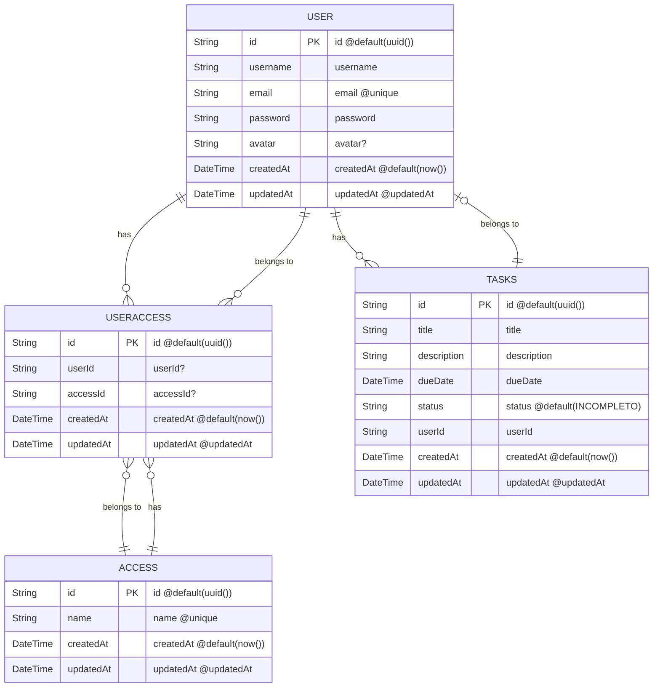

# Task App - ToDoList 

Descrição do Projeto 

Interface de Programação de Aplicação (API) criada para uso do **[Frontend](https://github.com/Guilhermeprog3/Front-Task)**

E essa **[API](https://deploy-task-api.onrender.com/)** está no ar ✈

Deseja ver as rotas rotas? Consulte nossa **[documentação](https://deploy-task-api.onrender.com/api-docs/)**!
### 🛠️ Construído com:

 
Este projeto é uma aplicação web Full Stack desenvolvida com Node, Express e Prisma. 

### 🔧Instruções de Instalação e Configuração no Terminal 
Clone o Repositório: 
`git clone https://github.com/Jhopn/task-api.git` 

Entre na pasta da aplicação: 
`$ cd task-api` 

Instale as Dependências: 
`npm install` 
`yarn install` 

Crie o acesso para administrador e usuário: 
`npm run access` 

Inicie o Servidor de Desenvolvimento: 
`npm run dev` 

#### OBS: Certifique-se de que o backend está rodando na URL especificada.  

### 📈 Schema  

 

